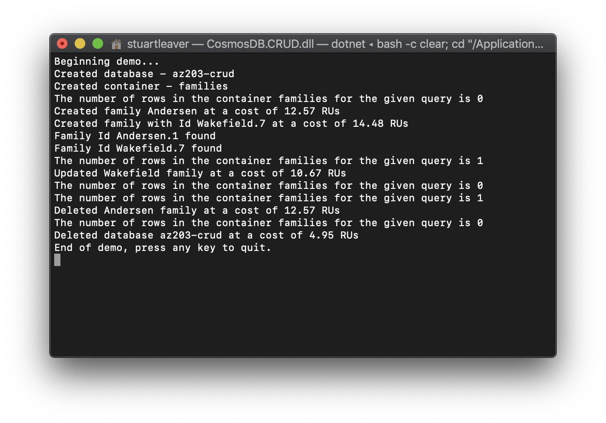

# Azure Cosmos DB CRUD Operations

An example using the SQL API of the following:
* Scaler function to count documents in a container.
* Create a strongly typed document.
  * By creating a new document with `CreateItemAsync`.
  * By checking if the document already exists with `ReadItemAsync` the with `CreateItemAsync`.
* Update a strongly typed document.
* Delete a strongly typed document.
* Delete a database.

## Setup
1. [Create an Azure Cosmos DB account](https://docs.microsoft.com/en-us/azure/cosmos-db/how-to-manage-database-account)

2. In `Program.cs`, enter you EndpointUri and PrimaryKey values which can be found in the `Keys` blade of your Cosmos DB account.
```cs
// The Azure Cosmos DB endpoint for running this sample.
private static readonly string EndpointUri = "<your endpoint here>";
// The primary key for the Azure Cosmos account.
private static readonly string PrimaryKey = "<your primary key>";
```

3. If running for the first time, a database named `az203-crud` will be created along with a container named `families`.

## Running
1. The demo will run after setting up the database and container. When finished, your console window should look like the following:


2. Press any key to exit.
