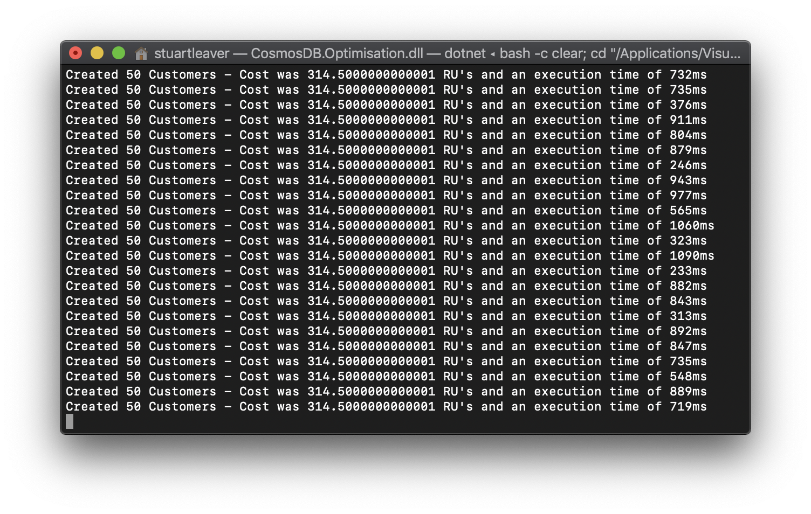
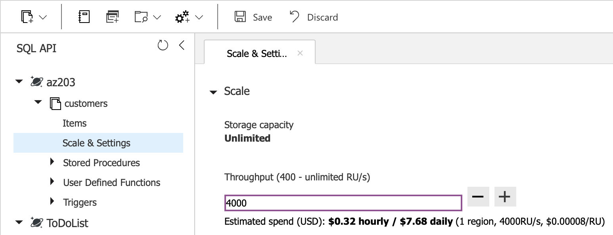
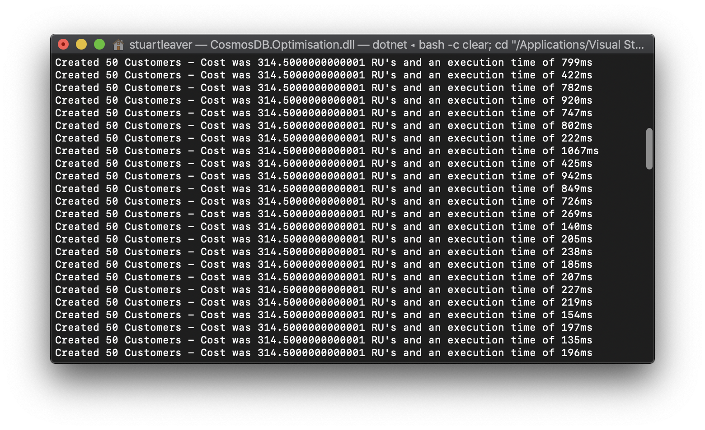

# Azure Cosmos DB Optimisation

An example of how increasing and decreasing the RU's of a container can affect the speed at which your application can create documents.

## Setup
1. [Create an Azure Cosmos DB account](https://docs.microsoft.com/en-us/azure/cosmos-db/how-to-manage-database-account)

2. In `Program.cs`, enter you EndpointUri and PrimaryKey values which can be found in the `Keys` blade of your Cosmos DB account.
```cs
// The Azure Cosmos DB endpoint for running this sample.
private static readonly string EndpointUri = "<your endpoint here>";
// The primary key for the Azure Cosmos account.
private static readonly string PrimaryKey = "<your primary key>";
```

3. Set the number of Customers that will be created. To see a much bigger change in speed, it is suggested to keep the value above `50`.

4. If running for the first time, a database named `az203` will be created along with a container named `customers`.

## Running
1. The demo will run after setting up the database and container. With the default of 400 RU's and depending on the number of Customers created in each batch and the internet speed, the output will look like:


2. In the Azure Portal, change the RU's for the `customers` container to `4000`. This will increase the throughput:


3. View the output window and a drop in the execution time should be seen. In the screenshot, roughly halfway down:

